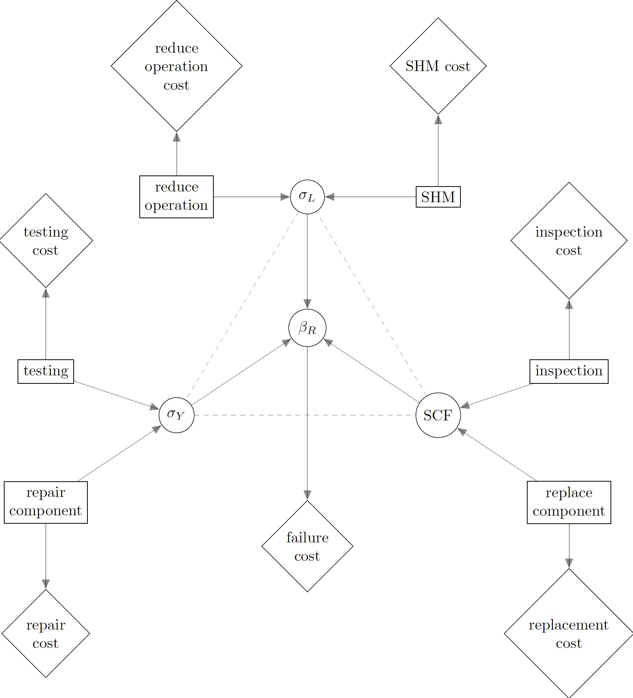
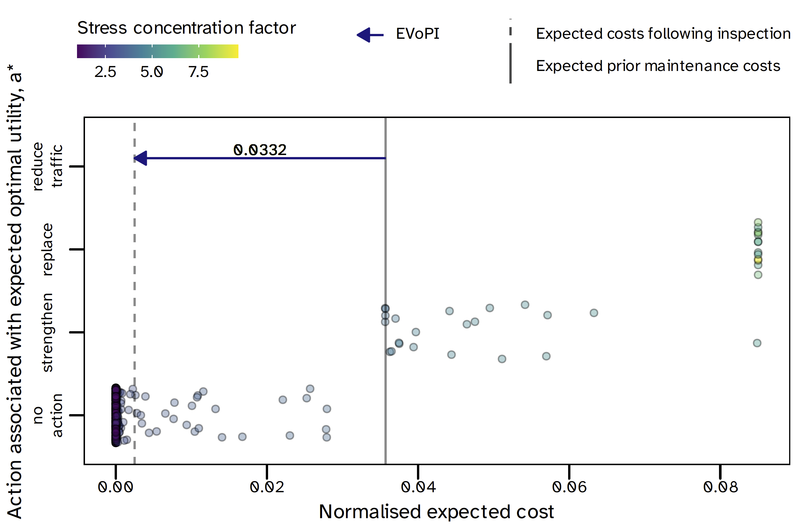
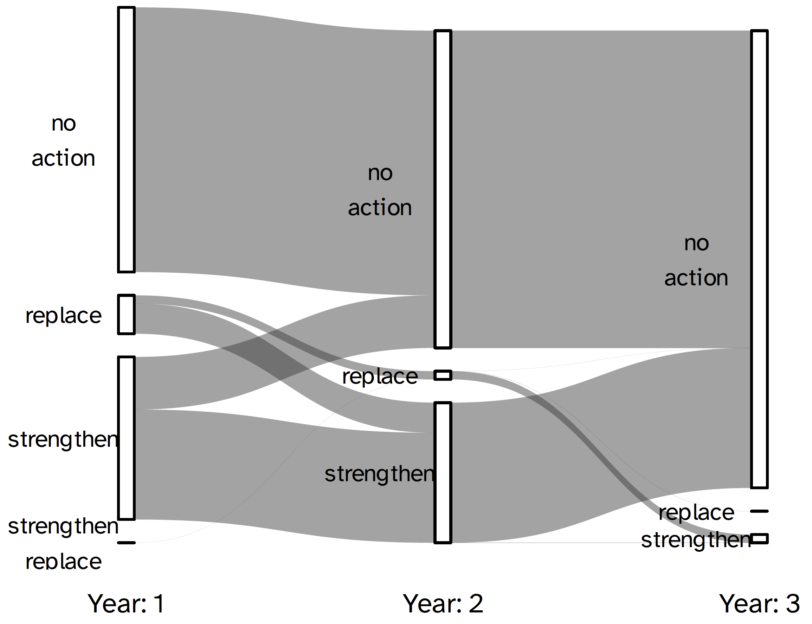

# System Effects in Identifying Risk-Optimal Data Requirements for Digital Twins of Structures

This repository is associated with a research paper that has been submitted to the Journal of Reliability Engineering & System Safety.
The preprint is available here: link.

Within the *analysis* folder, the file *system_effects_in_VoI.jl* is a Julia file that contains all of the calculations used to produce the results in the paper.
Within the "results_files" folder, are the simulations used to estimate the expected value of various combinations of data collection activities. This is the raw data used to produce the visualisations in the paper.
 
## Abstract:

Structural Health Monitoring (SHM) technologies offer much promise to the risk management of the built environment, and they are therefore an active area of research. However, information regarding material properties, such as toughness and strength is instead measured in destructive lab tests. Similarly, the presence of geometrical anomalies is more commonly detected and sized by inspection. Therefore, a risk-optimal combination should be sought, acknowledging that different scenarios will be associated with different data requirements.

Value of Information (VoI) analysis is an established statistical framework for quantifying the expected benefit of a prospective data collection activity. In this paper the expected value of various combinations of inspection, SHM and testing are quantified, in the context of supporting risk management of a location of stress concentration in a railway bridge. The Julia code for this analysis (probabilistic models and influence diagrams) is made available. The system-level results differ from a simple linear sum of marginal VoI estimates, i.e. the expected value of collecting data from SHM and inspection together is not equal to the expected value of SHM data plus the expected value of inspection data. In summary, **system-level decision making, requires system-level models**.

## Selected Figures

Figure 9: Extension of "ECA triangle" (see dashed lines) to influence diagram representation of structural integrity management decision problem

Figure 10: Expected value of perfect inspection data

Figure 15: Sequences of optimal actions (w.r.t. expected utility) forecasting over a three-year period

